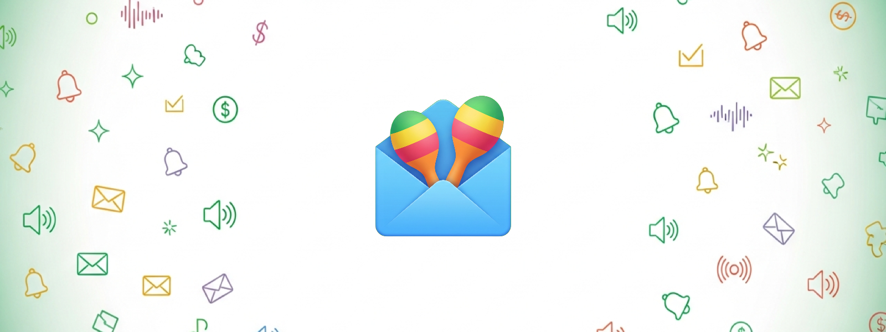
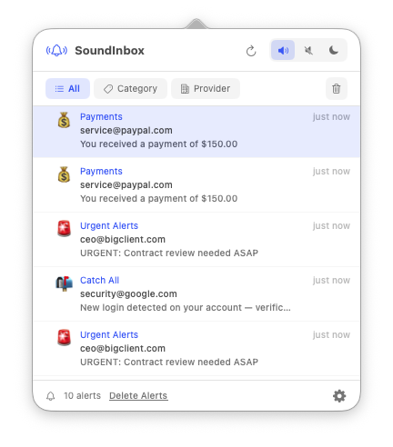
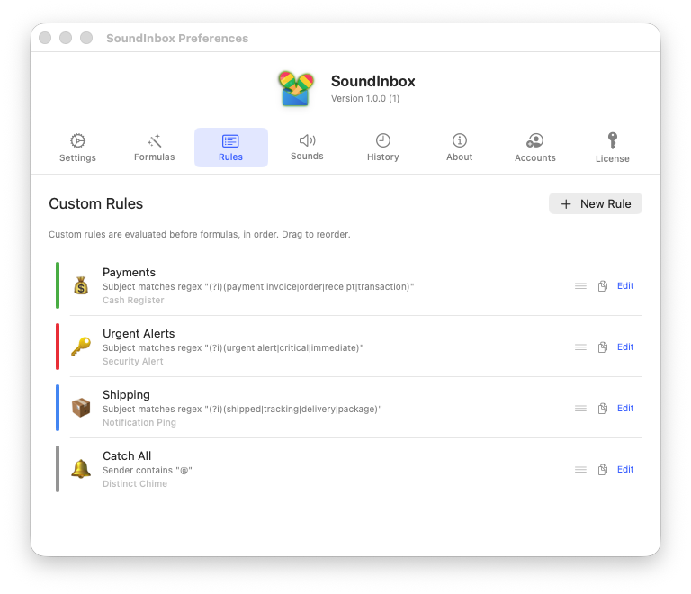
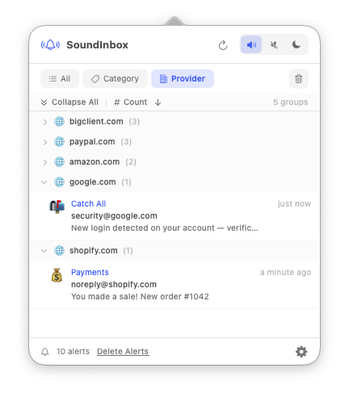
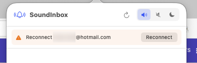

<p align="center">
  
</p>

<h1 align="center">SoundInbox</h1>

<p align="center">
  <a href="https://drolosoft.com/soundinbox.html"></a>
  <a href="https://drolosoft.com/soundinbox.html"></a>
  <a href="LICENSE"></a>
  <a href="https://github.com/drolosoft/homebrew-tap"></a>
  <a href="https://github.com/drolosoft/soundinbox/releases"></a>
  <a href="https://drolosoft.com/soundinbox.html"></a>
</p>

> **Stop checking email. Start hearing what matters.**

You check email dozens of times a day looking for the one message that actually matters. Every interruption to glance at your inbox — even for two seconds — breaks your focus and steals time you don't get back. **SoundInbox** removes the need to check. It lives silently in the macOS menu bar and fires the exact sound you defined for the exact event you care about. Payment received? Cash register. Urgent client? Alarm. Everything else? Complete silence.

<p align="center"></p>

<p align="center">
  <video src="https://github.com/drolosoft/soundinbox/releases/download/v1.1.2/sound-inbox-demo.mp4" width="600" autoplay loop muted playsinline></video>
</p>

---

## ⚡ Quick Start

### Install with Homebrew (Coming Soon)

```bash
brew install --cask drolosoft/tap/soundinbox
```

> The Homebrew cask is not published yet. Use Direct Download below until then.

### Direct Download

Download the `.dmg` from [GitHub Releases](https://github.com/drolosoft/soundinbox/releases) or from [drolosoft.com/soundinbox](https://drolosoft.com/soundinbox.html). ~26 MB universal binary — no Electron, no dependencies.

### Try It

```
# 1  Install and connect your Gmail*, Outlook, or IMAP account
# 2  Activate the formulas you care about (or create your own)
# 3  Go back to your work — the right sound plays when the right email arrives
```

---

> **\*Gmail note:** Gmail OAuth is pending Google verification. During sign-in you'll see an "unverified app" screen — click **Advanced → Go to SoundInbox** to proceed safely. This is cosmetic and will disappear once Google completes the review. Outlook and IMAP work without any warnings.

## 🔍 Features

|  | Feature | Description |
|---|---|---|
| 🧪 | **Formula Gallery** | 10 pre-built detection formulas — payments, sales, urgent, shipping, security, and more. Toggle on and start hearing alerts immediately. Zero configuration. |
| ⚙️ | **Custom Rule Engine** | Build your own rules with AND/OR logic, regex matching, domain filtering, and per-field conditions across sender, subject, body, and recipient. |
| 🔊 | **Sound Library** | 15 curated alert sounds — from a cash register cha-ching to a zen water drop. Each under 3 seconds, distinct, and non-intrusive. |
| 📊 | **Match History** | A scrollable timeline of every alert fired, with stats on most active formulas and busiest hours of the day. |
| 🔇 | **Silent by Default** | Unmatched emails produce no sound. You opt in to noise, not out of it. Only what you define as important makes a sound. |
| 📌 | **Invisible Until Needed** | No dock icon. No main window. Lives in the status bar doing its job — you forget it's there until the right sound plays. |
| 🔄 | **Auto-Recovery** | Transient failures (timeouts, server errors) are retried automatically. If your provider revokes a token, SoundInbox notifies you and shows a one-tap Reconnect button. |
| 📬 | **Gmail, Outlook & IMAP** | Connect Gmail (OAuth2*), Outlook/Hotmail (OAuth2), or any IMAP server. Multiple accounts supported on Pro. |

<p align="center"></p>

### ⚙️ Custom Rules with Regex

Build powerful detection rules with regex patterns, drag to reorder priority, and assign any sound to each rule.

<p align="center"></p>

### 📬 Group by Provider

See all your alerts organized by email provider — instantly spot which domains are sending the most.

<p align="center"></p>

### 🔄 Smart Reconnection

If your email provider expires a session (password change, security review, token rotation), SoundInbox detects it instantly — no cryptic error messages. A one-tap **Reconnect** button appears right in the popover. Click it, sign in, done.

<p align="center"></p>

> SoundInbox automatically retries transient failures (timeouts, server errors) before showing any error. The Reconnect button only appears when your provider permanently revoked the session — something only you can fix by signing in again.

---

## 🧪 10 Pre-Built Formulas

Each formula is a curated set of conditions that detect a specific category of email. One tap to activate. Nothing else required.

| | Formula | Detects | Sound |
|---|---|---|---|
| 💰 | **Payment Received** | PayPal, Stripe, Wise, bank transfers | Cash Register |
| 🛒 | **New Sale** | Shopify, WooCommerce, Gumroad, Etsy | Victory Chime |
| ✅ | **Approved / Confirmed** | approved, accepted, confirmed | Soft Success |
| 🚨 | **Urgent Client Email** | URGENT, ASAP, critical | Alarm Pulse |
| 📦 | **Order Shipped** | shipped, tracking, on its way | Notification Ping |
| 💌 | **VIP Sender** | User-defined whitelist | Distinct Chime |
| 🧾 | **Invoice Received** | invoice, factura, bill | Paper Slide |
| 🔑 | **Login / Security** | login, password, 2FA | Security Alert |
| 📅 | **Meeting / Calendar** | invitation, meeting, scheduled | Calendar Ping |
| 🤫 | **Everything Else** | Catch-all — silent by default | Silent |

---

## 🔊 15 Curated Sounds

Every sound is under 3 seconds, distinct, and non-intrusive — from subtle and informational to urgent and celebratory.

| | Sound | Description |
|---|---|---|
| 💰 | **Cash Register** | Classic mechanical register — money sound |
| 🏆 | **Victory Chime** | Short ascending melody — celebratory |
| ✅ | **Soft Success** | Gentle two-tone confirmation — calm |
| 🚨 | **Alarm Pulse** | Repeating electronic pulse — urgent |
| 📬 | **Notification Ping** | Clean single ping — neutral |
| 🔔 | **Distinct Chime** | Bell-like — attention-grabbing |
| 📄 | **Paper Slide** | Paper-shuffle — subtle |
| 🔐 | **Security Alert** | Low two-tone — serious |
| 📅 | **Calendar Ping** | Light marimba — friendly |
| 💬 | **Message Pop** | Soft pop — messaging style |
| 📣 | **Trumpet Fanfare** | Micro fanfare — major wins |
| 🌊 | **Ocean Drop** | Water drop — zen |
| ⚡ | **Electric Spark** | Electric zap — energetic |
| 🎵 | **Marimba Up** | Ascending marimba — cheerful |
| 🔇 | **Silent** | No sound — suppresses audio |

---

## 🆚 Why SoundInbox?

Your inbox doesn't need another badge count. It needs a voice.

| | Without SoundInbox | With SoundInbox |
|:---:|---|---|
| 💰 | Check email to see if payment arrived | **Hear the cash register** — keep working |
| 🚨 | Miss urgent client email for 2 hours | **Alarm fires immediately** — you respond fast |
| 📬 | Generic ding for every email | **Distinct sounds** — know WHAT arrived without looking |
| 🔇 | Newsletter spam buzzes your phone | **Silent by default** — only important emails make noise |
| 📊 | No idea how often you check | **Match history** — see what actually matters |
| ⏱️ | Context switch dozens of times/day | **Zero interruptions** — the sound IS the check |

<p align="center"></p>

---

## 🔒 Your Data Stays Local

SoundInbox polls your inbox via IMAP (Gmail, Outlook, and generic IMAP servers) and evaluates rules locally on your Mac. No email content is stored, transmitted, or processed on any server. OAuth tokens and credentials live in the macOS Keychain. Match history is local and clearable anytime.

→ Full privacy policy: [drolosoft.com/soundinbox/privacy](https://drolosoft.com/soundinbox/privacy)

---

## 💰 Free vs Pro

|  | Free | Pro — $9.99 |
|---|---|---|
| All formulas & custom rules | ✅ | ✅ |
| All 15 sounds + custom uploads | ✅ | ✅ |
| Regex matching, speech alerts, DND | ✅ | ✅ |
| Match history & statistics | ✅ | ✅ |
| Email accounts | 1 | **Up to 5** |
| Mac devices | 1 | **Up to 3** |
| Price | **Free forever** | **One-time purchase** |

> **No subscription. No recurring charges. You own it.**

See [full pricing details](https://drolosoft.com/soundinbox/pricing) with FAQ.

<p align="center"></p>

---

## 🛠️ Built With

Fully native. No Electron, no web wrappers, no cross-platform frameworks. ~26 MB universal binary.

- **Swift 6.3** — Strict concurrency, modern async/await
- **SwiftUI + AppKit** — NSStatusItem, NSPopover, native menus
- **AVAudioPlayer** — System audio with macOS sound fallback
- **Sparkle** — Automatic updates

---

## ❓ FAQ

<details>
<summary><strong>How do I activate my Pro license?</strong></summary>
<br>
After purchase you'll receive a license key by email. In SoundInbox, open <strong>Preferences → License</strong>, paste your key, and click Activate. Takes two seconds.
</details>

<details>
<summary><strong>Can I use one license on multiple Macs?</strong></summary>
<br>
Yes. Pro supports up to <strong>5 email accounts</strong> and up to <strong>3 Mac devices</strong> simultaneously. Swap a device from Preferences → License → Manage Devices.
</details>

<details>
<summary><strong>Is there a subscription?</strong></summary>
<br>
No. $9.99 is a one-time payment. You own the license forever.
</details>

<details>
<summary><strong>What's your refund policy?</strong></summary>
<br>
30-day full refund, no questions asked. Email <a href="mailto:support@drolosoft.com">support@drolosoft.com</a>.
</details>

<details>
<summary><strong>Does it work offline?</strong></summary>
<br>
SoundInbox needs an internet connection to poll email. The license check works offline once activated.
</details>

<details>
<summary><strong>Does it support Outlook or IMAP?</strong></summary>
<br>
Yes! SoundInbox supports <strong>Gmail</strong> (OAuth2), <strong>Outlook / Microsoft 365 / Hotmail</strong> (OAuth2), and <strong>generic IMAP</strong> (DreamHost, Fastmail, iCloud, Zoho, Yahoo, AOL, and any custom IMAP server). All three providers are fully integrated with automatic token refresh and one-tap reconnection if your provider expires a session.
</details>

---

## 📚 Resources

| | Link |
|---|---|
| 🌐 | [Product Page](https://drolosoft.com/soundinbox.html) |
| 💰 | [Pricing & FAQ](https://drolosoft.com/soundinbox/pricing) |
| 📥 | [Download & Install](https://drolosoft.com/soundinbox/download) |
| 🔒 | [Privacy Policy](https://drolosoft.com/soundinbox/privacy) |
| 📋 | [Changelog](https://drolosoft.com/soundinbox/changelog) |
| 🐛 | [Report Issues](https://github.com/drolosoft/soundinbox/issues) |

---

## 🌟 Contributing

Found a bug? Have a feature idea? [Open an issue](https://github.com/drolosoft/soundinbox/issues) — we read every one.

If SoundInbox helps you focus, consider giving it a ⭐ on GitHub — it helps others discover the project.

---

## ☕ Support

If SoundInbox saved you time or helped you stay focused, consider buying me a coffee — it keeps the next one coming!

<p align="center">
<a href="https://buymeacoffee.com/juan.andres.morenorub.io"></a>
</p>

---

## 📜 License

SoundInbox is proprietary software. See [LICENSE](LICENSE) for details.  
Documentation is licensed under [CC BY 4.0](https://creativecommons.org/licenses/by/4.0/).

**Forged by [Drolosoft](https://drolosoft.com)** · *Tools we wish existed*
